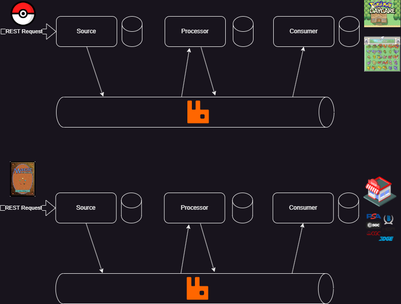

# Spring Cloud Stream Demo

Spring Cloud Stream is a nice tool we can use to build event-driven microservices. This demo goes over how to use spring cloud stream with RabbitMQ. The main components for spring cloud stream are the source, processor and consumer.

- Source: Produces the data stream. The initial entry point for the stream. The source can come from many different areas a few expamples are: database triggers, message queues, and REST endpoints.
- Processor: Transforms and/or filters incoming data streams. Can perform operations like aggregation, filtering, and mapping of data. 
- Consumer: The final destination of the data stream usally known as the sink. Consumers can perform actions like updating databases, sending emails, or calling other services.

## Requirements
- Java 17
- RabbitMQ (https://www.rabbitmq.com/docs/install-windows#dependencies)
- PostgreSQL (https://www.postgresql.org/download/)

## Spring Cloud Stream Visual Examples
